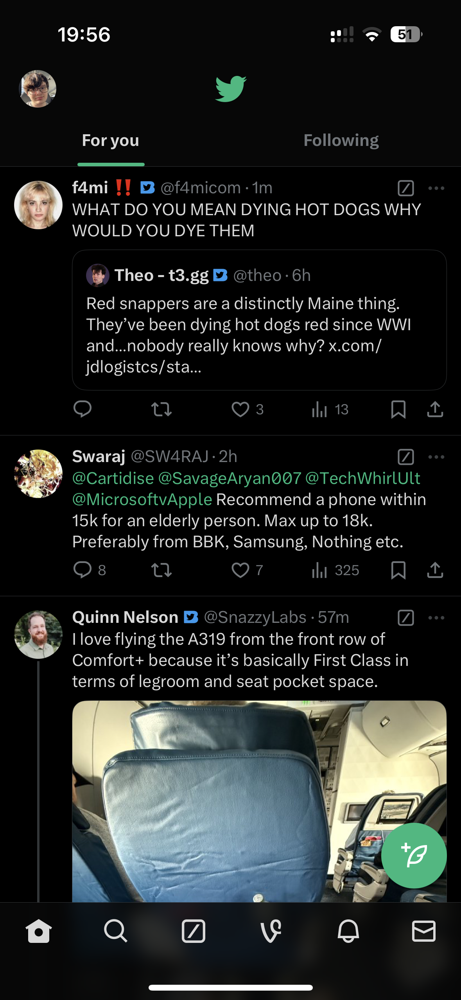
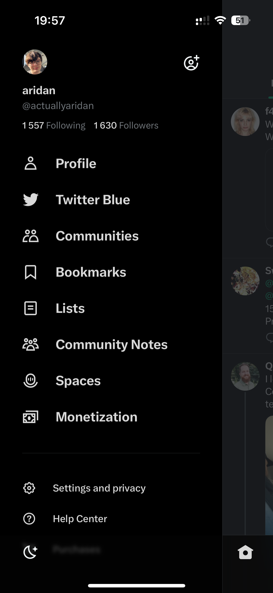
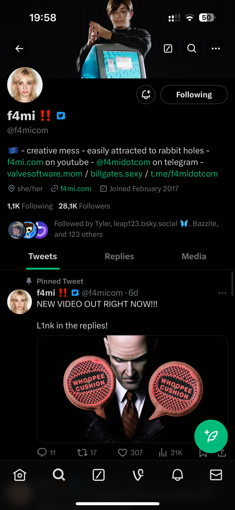
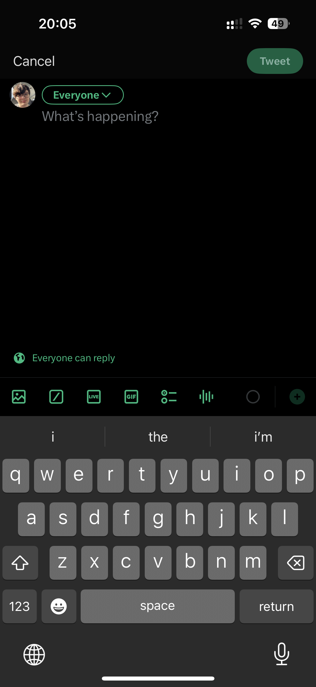
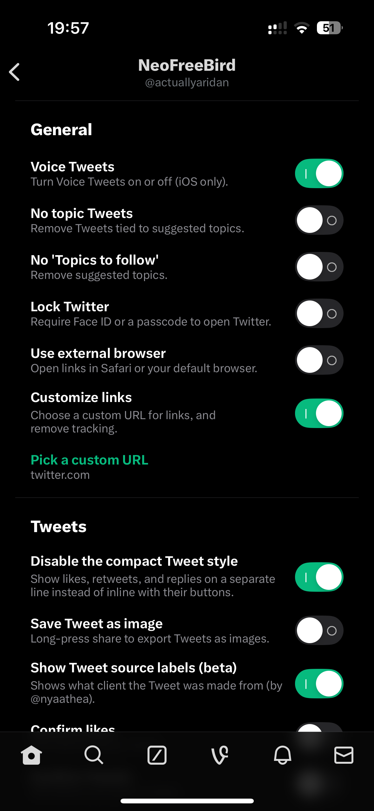
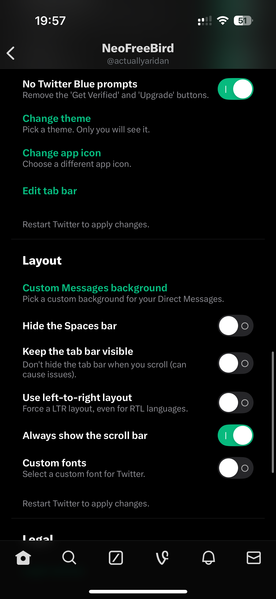
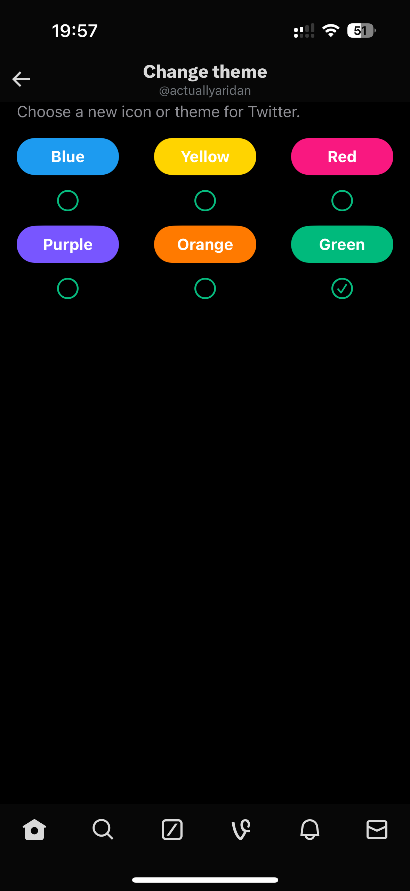
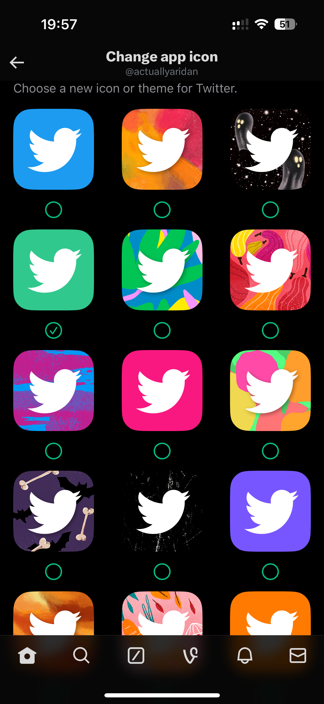

    
 
  # NeoFreeBird
  <i>Twitter, the way you want it</i>

  

    A modified Twitter app, with branding reverts, <a href="https://github.com/actuallyaridan/NeoFreeBird-BHTwitter">an updated BHTwitter fork</a>, and other QoL changes.
      
    Forked from <a href="https://github.com/nyathea/FreeBird">FreeBird by nyathea</a> and <a href="https://github.com/BandarHL/BHTwitter">BHTwitter by BandarHL</a>.
     
  

  

    
    &nbsp;
    
    &nbsp;
    
    &nbsp;
    
  

 

| | | |
|:-------------------------:|:-------------------------:|:-------------------------:|
|  |  |  |
|  |  |  |

## Features
NeoFreeBird is an modern Twitter/X version with various changes such as branding reverts, removal of unnecessary features, along with our own fork of BHTwitter for blocking ads, getting various Twitter Blue features for free and being able to customize Twitter in various ways. Theres tons of new features to try!

| | | |
|:-------------------------:|:-------------------------:|:-------------------------:|
|  |  |  |
|  |  |  |
|  |   |   |

> [!NOTE]  
> <b>There are some remains</b> You may still see some X branding and references to posts/posting, especially in web based stuff like Community Notes. We try our best to get rid of most of them.

> [!TIP]
> <b>Would you rather add the patches yourself instead of using the IPA?</b>  
> You can follow [these instructions](/docs/P-I-Y.md) in order to make your own NeoFreeBird.
> Don't forget to run it through [NeoFreeBird-BHTwitter](https://github.com/actuallyaridan/NeoFreeBird-BHTwitter) to get all features!
